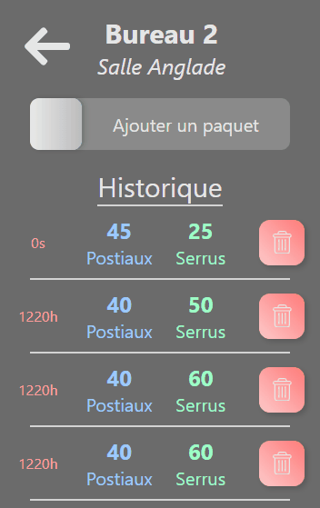

<h1 align="center" >Roda-Elec</h1>
  
<em>Suivre l'évolution municipale de l'élection  à la Roque d'Anthéron</em>

 

  
  

 

Roda-Elec permet à plusieurs asseseurs de tenir le compte des votes tout en restant informés de l'évolution de situation. Le compte des voix est géré par les websockets afin d'avoir une information toujours pertinente.

### Infos

Ce site est destiné aux utilisateurs mobiles, même si s'il reste fonctionnel sur de plus grandes résolutions.

### Essayer

Une version est publiée sur heroku : [Roda-Elec](https://roda-elec.herokuapp.com).

### Technologies

Reactjs + Typescript + Firebase + Websockets
